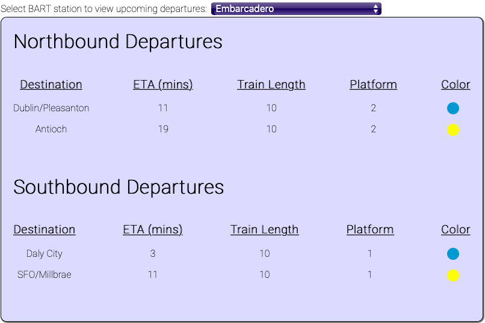

# BART Tracker 
App built to track upcoming BART train departures at each station throughout the Bay Area. User can select a BART station to view upcoming departures and train information. 

Built with Javascript and uses BART's API to pull train information and departures in real-time. 

## Screenshot

